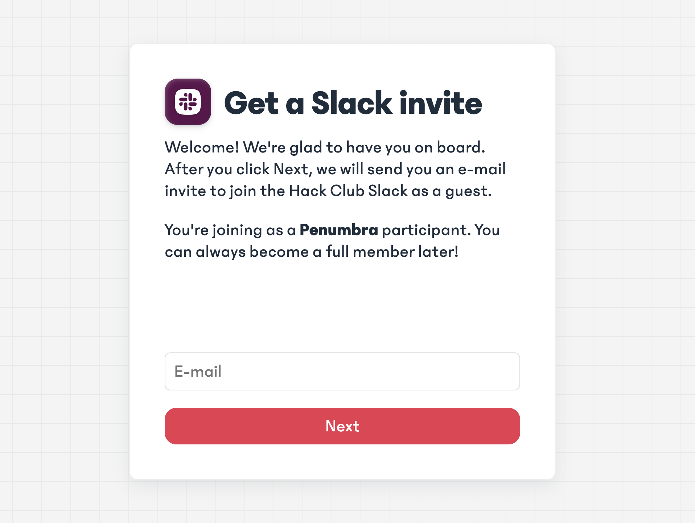

# Hack Club Slack Gateway
Invites users as multi-channel guests to YSWS-specific channels in the Hack Club slack.



## Usage
First, add your YSWS program to [`ysws.jsonc`](https://github.com/hackclub/slack-gateway/blob/main/ysws.jsonc) via a PR:

```diff
  [
     {
         "name": "penumbra",
         "displayName": "Penumbra",
         "active": true,
         "channels": [
            "C0266FRGT", // #announcements
            "C09EC7ZS05S", // #penumbra
            "C039PAG1AV7" // #slack-welcome-start
        ]
     },
+    {
+        "name": "cool-ysws",
+        "displayName": "A Cool YSWS",
+        "active": true,
+        "channels": [
+           "C0266FRGT", // #announcements
+           "C098BNM86FM", // #<CHANNEL NAME HERE>
+           "C039PAG1AV7" // #slack-welcome-start
+       ]
+    }
  ]
```

You can copy your channel ID by right clicking on a Slack channel, then using on `Copy > Copy link`. The last component of the URL is the channel ID, e.g. for `https://hackclub.slack.com/archives/C098BNM86FM`, `C098BNM86FM` is the ID.

After submissions for your YSWS close, be sure to create another PR to set `active` to `false`.

> [!NOTE]
> It's highly recommend to add your multi-channel guests to a channel like `#slack-welcome-start`, where they can "graduate" to a full member.

Then, redirect your users to `https://slack-gateway.hackclub.com/invite?ysws=<NAME>`, where `<NAME>` is the name for your YSWS program - for example, [`https://slack-gateway.hackclub.com/invite?ysws=penumbra`](https://slack-gateway.hackclub.com/invite?ysws=penumbra).

That's it! Users that sign up through your `ysws` slug will get invited to the specified `channel` as a [Multi-Channel Guest](https://slack.com/help/articles/202518103-Understand-guest-roles-in-Slack).

> [!WARNING]
> This system will use [Charon](http://github.com/hackclub/charon) in the future, and eventually be migrated into it. This will change the way of how YSWS programs are registered.

## Hosting
You'll first need to create a `.env` file. Do `cp .env.example .env`, and set the following:
- `BOT_TOKEN`: the bot token (found in **OAuth & Permissions**) with at least the following scopes: `users:read`, `users.profile:read`, and `users:read.email`.
- `USER_TOKEN`: a token to a user account that is a Workspace Admin. The invites are going to appear as coming from this user. You can retrieve this by running [this](https://gist.github.com/maxwofford/5779ea072a5485ae3b324f03bc5738e1) in your DevTools console.
- `SLACK_COOKIE`: a portion of your Slack cookie. Only the `d` cookie is required.
